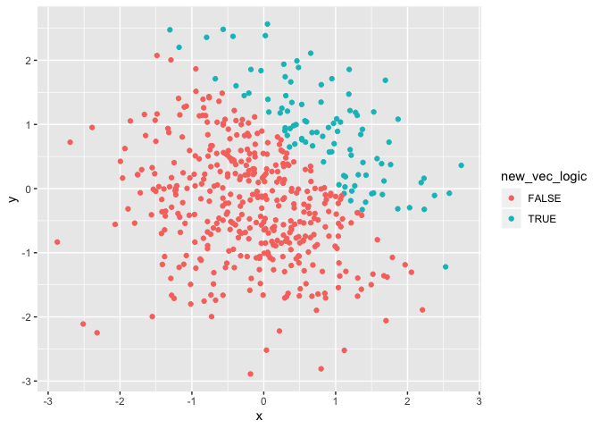
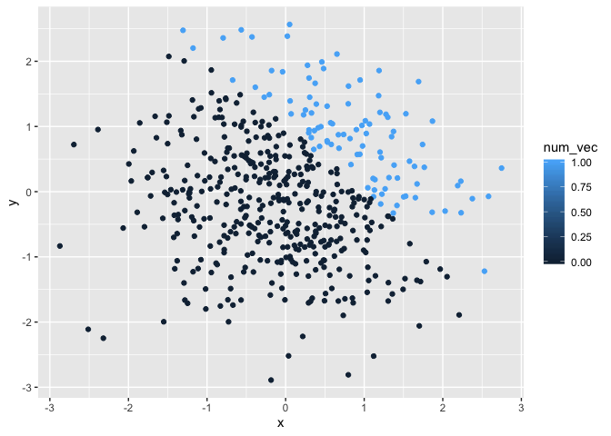
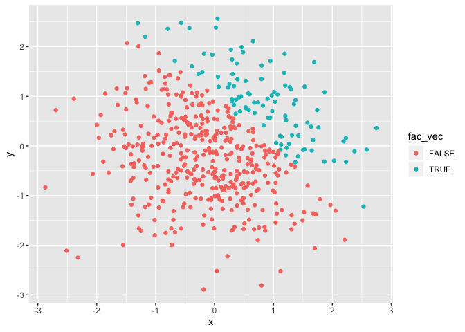

P8105 Homework 1
================
Alice Tivarovsky
2019-09-12

# Problem 1

We are creating a dataframe composed of a sample vector, logical vector,
character vector, and factor
    vector.

``` r
library(tidyverse)
```

    ## ── Attaching packages ──────────────────────────────────── tidyverse 1.2.1 ──

    ## ✔ ggplot2 3.2.1     ✔ purrr   0.3.2
    ## ✔ tibble  2.1.3     ✔ dplyr   0.8.3
    ## ✔ tidyr   0.8.3     ✔ stringr 1.4.0
    ## ✔ readr   1.3.1     ✔ forcats 0.4.0

    ## ── Conflicts ─────────────────────────────────────── tidyverse_conflicts() ──
    ## ✖ dplyr::filter() masks stats::filter()
    ## ✖ dplyr::lag()    masks stats::lag()

``` r
prob_1 = tibble(
  vec_samp = rnorm(8),
  vec_logical = vec_samp > 0,
  vec_char = c("one", "two", "three", "four", "five", "six", "seven", "eight"),
  vec_factor = factor(c("level1", "level1", "level1", "level2", "level2", "level2", "level3", "level3"))
)

mean(pull(prob_1, vec_samp))
```

    ## [1] 0.2032481

``` r
mean(pull(prob_1, vec_logical))
```

    ## [1] 0.5

``` r
mean(pull(prob_1, vec_char))
```

    ## Warning in mean.default(pull(prob_1, vec_char)): argument is not numeric or
    ## logical: returning NA

    ## [1] NA

``` r
mean(pull(prob_1, vec_factor))
```

    ## Warning in mean.default(pull(prob_1, vec_factor)): argument is not numeric
    ## or logical: returning NA

    ## [1] NA

Taking the mean for the numeric vector and logical vector returns
results. Taking the mean for the character vector and the factor vector
returns errors.

This is a second code chunk for problem 1. It coerces the logical,
character, and factor vectors to numeric vectors:

``` r
as.numeric(pull(prob_1, vec_logical))
```

    ## [1] 1 0 1 0 0 1 1 0

``` r
as.numeric(pull(prob_1, vec_char))
```

    ## Warning: NAs introduced by coercion

    ## [1] NA NA NA NA NA NA NA NA

``` r
as.numeric(pull(prob_1, vec_factor))
```

    ## [1] 1 1 1 2 2 2 3 3

The logical vector was coerced into the following numeric vector: (1 1 0
0 0 0 0 0) because “true” corresponds to 1 and “false” corresponds to 0
in R. The character vector was coerced into eight NA’s because R does
not convert characters to real numbers. The factor vector was coerced
into the following numeric vector: (1 1 1 2 2 2 3 3), which appears to
have extracted the number from the character statements in the arguments
of the factor vector - “level1” was coerced to “1”, “level2” was coerced
to “2”, etc. This explains why we were able to take the mean of the
logical vector and unable to take the mean of the character vector.
However, we were unable to take the mean of the factor vector even
though it could be
    coerced.

``` r
as.numeric(pull(prob_1, vec_logical))*pull(prob_1, vec_samp)
```

    ## [1] 0.5835364 0.0000000 0.7819610 0.0000000 0.0000000 0.7113857 0.7917876
    ## [8] 0.0000000

``` r
as.factor(pull(prob_1, vec_logical))*pull(prob_1, vec_samp)
```

    ## Warning in Ops.factor(as.factor(pull(prob_1, vec_logical)), pull(prob_1, :
    ## '*' not meaningful for factors

    ## [1] NA NA NA NA NA NA NA NA

``` r
as.numeric(as.factor(pull(prob_1, vec_logical)))*pull(prob_1, vec_samp)
```

    ## [1]  1.16707276 -0.93807835  1.56392204 -0.06484356 -0.19992874  1.42277149
    ## [7]  1.58357512 -0.03983549

# Problem 2

## Creating a New Data Frame

We are creating a new data frame composed of different types of vectors.

``` r
prob_2 = tibble (
  x = rnorm (500),
  y = rnorm (500),
  new_vec_logic = x + y > 1,
  num_vec = as.numeric(new_vec_logic), 
  fac_vec = as.factor(new_vec_logic)
)
```

## Quantifying the Data Frame

The size of this dataset is 500 rows by 5 columns. The mean of x is
0.0036491. The median of x is 0.0151223. The standard deviation of x is
0.94153. The proportion of cases for which x+y \> 1 is 0.196.

### Creating a Scatter Plot of the Data Frame

We are creating a scatterplot of y vs x, assigning one of two colors to
each point based on the outcome of the logcial vector new\_vec\_logic.

``` r
ggplot(prob_2, aes(x=x, y=y, color= new_vec_logic)) + geom_point()
```

<!-- -->

We are now creating a scatterplot of y vs x, assigning one of two colors
to each point based on the value of vector “num\_vec”, which coereced
the logical vector “new\_vec\_logic” into 0’s and 1’s.

``` r
ggplot(prob_2, aes(x=x, y=y, color= num_vec)) + geom_point()
```

<!-- -->

Finally, we are creating a scatterplot of y vs x, assigning one of two
colors to each point based on the value of vector “fac\_vec”, which
coerced the logical vector into to factor vector.

``` r
ggplot(prob_2, aes(x = x, y = y, color = fac_vec)) + geom_point()
```

<!-- -->

``` r
ggsave("factor_vector.png", plot = last_plot())
```

    ## Saving 7 x 5 in image
