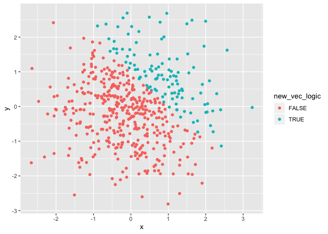

P8105 Homework 1
================
Alice Tivarovsky
2019-09-12

# Problem 1

## Creating dataframe

We are creating a dataframe composed of: a random sample of size 8 from
a standard Normal distribution, a logical vector indicating whether
elements of the sample are greater than 0, a character vector of length
8, and a factor vector of length 8, with 3 different factor
    “levels”

``` r
library(tidyverse)
```

    ## ── Attaching packages ──────────────────────────────────── tidyverse 1.2.1 ──

    ## ✔ ggplot2 3.2.1     ✔ purrr   0.3.2
    ## ✔ tibble  2.1.3     ✔ dplyr   0.8.3
    ## ✔ tidyr   0.8.3     ✔ stringr 1.4.0
    ## ✔ readr   1.3.1     ✔ forcats 0.4.0

    ## ── Conflicts ─────────────────────────────────────── tidyverse_conflicts() ──
    ## ✖ dplyr::filter() masks stats::filter()
    ## ✖ dplyr::lag()    masks stats::lag()

``` r
# Set a seed for reproducibility
set.seed(123)

# Put the specified vectors into a tibble
prob_1 = tibble(
  vec_samp = rnorm(8),
  vec_logical = vec_samp > 0,
  vec_char = c("one", "two", "three", "four", "five", "six", "seven", "eight"),
  vec_factor = factor(c("level1", "level1", "level1", "level2", "level2", "level2", "level3", "level3"))
)

# Now, we take the mean of each variable to see what works/doesn't
mean(pull(prob_1, vec_samp))
```

    ## [1] 0.2348464

``` r
mean(pull(prob_1, vec_logical))
```

    ## [1] 0.625

``` r
mean(pull(prob_1, vec_char))
```

    ## Warning in mean.default(pull(prob_1, vec_char)): argument is not numeric or
    ## logical: returning NA

    ## [1] NA

``` r
mean(pull(prob_1, vec_factor))
```

    ## Warning in mean.default(pull(prob_1, vec_factor)): argument is not numeric
    ## or logical: returning NA

    ## [1] NA

Taking the mean for the numeric vector and logical vector returns
results. Taking the mean for the character vector and the factor vector
returns errors because they are not numeric in nature.

## Coercing vectors into numeric form

This is a second code chunk for problem 1. It coerces the logical,
character, and factor vectors to numeric vectors:

``` r
as.numeric(pull(prob_1, vec_logical))
```

    ## [1] 0 0 1 1 1 1 1 0

``` r
as.numeric(pull(prob_1, vec_char))
```

    ## Warning: NAs introduced by coercion

    ## [1] NA NA NA NA NA NA NA NA

``` r
as.numeric(pull(prob_1, vec_factor))
```

    ## [1] 1 1 1 2 2 2 3 3

The logical vector was coerced into the following numeric vector: (1 1 0
0 0 0 0 0) because “true” corresponds to 1 and “false” corresponds to 0
in R. The character vector was coerced into eight NA’s because R does
not convert characters to real numbers. The factor vector was coerced
into the following numeric vector: (1 1 1 2 2 2 3 3), which appears to
have assigned numbers to each category, in increasing order. This
explains why we were able to take the mean of the logical vector and
unable to take the mean of the character vector. However, we were unable
to take the mean of the factor vector even though it could be coerced.

## Converting the logical vector

Finally, we convert the logical vector to numeric and character forms
and attempt to multiply the converted vector by the ranom sample vector
“vec\_samp” defined in
    “prob\_1.”

``` r
as.numeric(pull(prob_1, vec_logical))*pull(prob_1, vec_samp)
```

    ## [1] 0.00000000 0.00000000 1.55870831 0.07050839 0.12928774 1.71506499
    ## [7] 0.46091621 0.00000000

``` r
as.factor(pull(prob_1, vec_logical))*pull(prob_1, vec_samp)
```

    ## Warning in Ops.factor(as.factor(pull(prob_1, vec_logical)), pull(prob_1, :
    ## '*' not meaningful for factors

    ## [1] NA NA NA NA NA NA NA NA

``` r
as.numeric(as.factor(pull(prob_1, vec_logical)))*pull(prob_1, vec_samp)
```

    ## [1] -0.5604756 -0.2301775  3.1174166  0.1410168  0.2585755  3.4301300
    ## [7]  0.9218324 -1.2650612

This results in numeric vectors for the first and third expression and
an NA vector for the second expression. This occurs because the second
expression multiplies a factor vector by a number vector, which is
impossible unless the factor vector is first coerced into a numeric
vector.

# Problem 2

## Creating a New Data Frame

We are creating a new data frame comprised of x: a random sample of size
500 from a standard Normal distribution y: a random sample of size 500
from a standard Normal distribution A logical vector indicating whether
x + y \> 1 A numeric vector created by coercing the above logical vector
A factor vector created by coercing the above logical vector

``` r
prob_2 = tibble (
  x = rnorm (500),
  y = rnorm (500),
  new_vec_logic = x + y > 1,
  num_vec = as.numeric(new_vec_logic), 
  fac_vec = as.factor(new_vec_logic)
)
```

## Quantifying the Data Frame

The size of this dataset is 500 rows by 5 columns. The mean of x is
0.0220554. The median of x is 0.0092096. The standard deviation of x is
0.9759859. The proportion of cases for which x+y \> 1 is 0.226.

## Creating Scatterplots

We first create a scatterplot of y vs x, assigning one of two colors to
each point based on the outcome of the logcial vector new\_vec\_logic.

We then create a scatterplot of y vs x, assigning one of two colors to
each point based on the value of vector “num\_vec”, which coereced the
logical vector “new\_vec\_logic” into 0’s and 1’s.

Finally, we create a scatterplot of y vs x, assigning one of two colors
to each point based on the value of vector “fac\_vec”, which coerced the
logical vector into to factor vector.

We assign a name to the first plot and save it as
“plot\_1.png”.

``` r
plot_1 = ggplot(prob_2, aes(x = x, y = y, color = new_vec_logic)) + geom_point()
plot_1
```

<!-- -->

``` r
ggplot(prob_2, aes(x = x, y = y, color = num_vec)) + geom_point()
```

<!-- -->

``` r
ggplot(prob_2, aes(x = x, y = y, color = fac_vec)) + geom_point()
```

<!-- -->

``` r
ggsave("plot_1.png", plot = plot_1)
```

    ## Saving 7 x 5 in image
